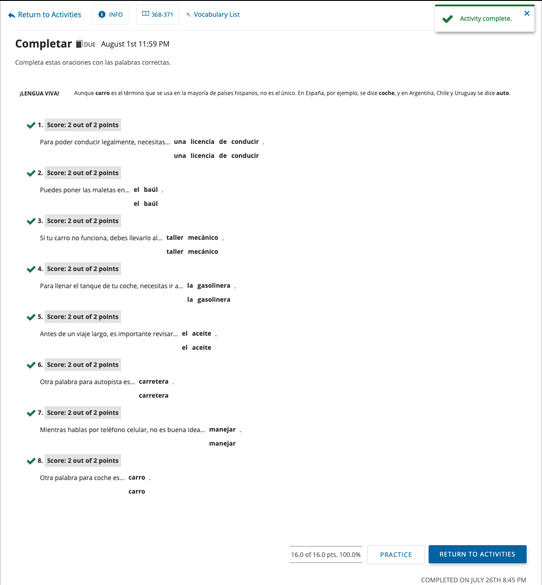

# spanish-quiz
A mockup of my own Spanish homework.  
When you begin, time starts. If you answer incorrectly, time is subtracted. 
At the end, localStorage is called to view your grade, which is tallied through the quiz. 
Deployed at: https://tannerlsmith.github.io/spanish-quiz/

* the first three questions are the answers

